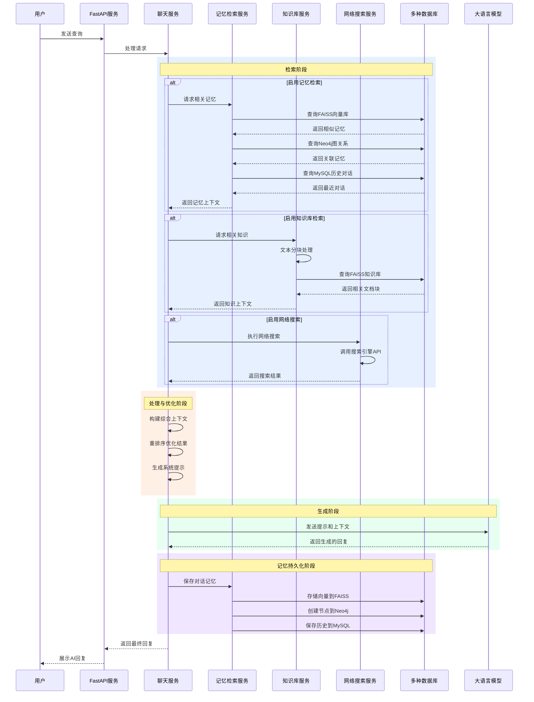

# Neko-AI

一个具有持久记忆功能的智能AI助手API服务，专注于RAG的底层实现，抽象出多种相关接口，致力于实现一个完整完善的AI AGENT后端服务

## 功能特点

- 🧠 **持久记忆**：使用Neo4j图数据库和FAISS向量数据库和MYSQL存储对话历史，并实现图关系记忆遗忘
- 🔍 **语义搜索**：使用向量相似度查找相关记忆
- 📊 **图关系分析**：基于图数据库的关系分析，主题分析，相识度分析，提供更好的上下文理解
- 🌐 **网页搜索功能**：支持使用DuckDuckGo、博查等搜索引擎执行实时网络搜索，辅助回答问题
- 📚 **知识库管理**：支持上传和管理自定义知识文档
- 💬 **多对话管理**：支持创建和管理多个独立对话，每个对话有自己的上下文环境
- 🚀 **高性能API**：基于FastAPI的高性能API服务
- 🔒 **安全认证**：API密钥验证机制保障服务安全
- 📝 **灵活配置**：通过YAML/JSON配置文件灵活配置服务参数
- 😘 **多种人设**：支持PROMT多种人设设置

## RAG检索增强生成实现细节

Neko-AI项目实现了强大的RAG（检索增强生成）系统，结合多种数据源提供智能上下文感知回复。以下是RAG流程的详细说明：



### 技术实现详细说明

#### 1. 多源检索系统

Neko-AI的RAG系统集成了多种数据源，以提供全面的上下文信息：

- **记忆检索**：
  - **FAISS向量数据库**：实现高效的语义相似度搜索，可快速检索与当前查询相关的历史对话
  - **Neo4j图数据库**：存储对话记忆的结构化关系，支持复杂的图查询和关联分析
  - **MySQL数据库**：存储和检索最新的对话历史（默认滑动窗口15轮对话）

- **知识库检索**：
  - **文档处理**：支持PDF、Word、TXT、CSV、Excel、Markdown等多种文档格式
  - **智能分块**：使用RecursiveCharacterTextSplitter进行文本分割，确保语义完整性
  - **向量索引**：使用FAISS实现高维向量的快速近邻搜索，支持亿级文档规模

- **网络搜索**：
  - **搜索引擎集成**：支持DuckDuckGo和百川等搜索引擎
  - **实时信息获取**：解决LLM知识截止问题，提供最新信息
  - **结果优化**：对搜索结果进行排序和筛选，增强相关性

#### 2. 上下文构建与优化流程

RAG的核心是有效地构建和优化上下文信息，Neko-AI采用多层次的上下文处理：

1. **数据收集**：从多个来源并行获取相关信息
2. **去重过滤**：移除重复内容，避免冗余信息干扰模型
3. **相关性排序**：根据相似度分数对检索结果进行排序
4. **重排序处理**：使用专用重排序API进一步优化结果顺序
5. **上下文裁剪**：根据模型token限制动态调整上下文长度
6. **结构化组织**：为不同来源的信息添加清晰的分隔和标记

#### 3. 提示构建与生成策略

有效的提示策略对RAG系统至关重要：

- **系统提示**：可通过配置文件和prompt.md模板自定义，设定AI的行为基准
- **上下文注入**：将检索到的信息以结构化方式注入到提示中
- **指令增强**：明确指导模型如何使用和引用检索到的信息
- **来源追踪**：为知识库和网络搜索结果保留来源信息，支持引用溯源

#### 4. 记忆持久化机制

对话完成后，系统会自动进行记忆持久化，确保知识可累积：

1. **向量化处理**：将用户问题和AI回复组合生成嵌入向量
2. **多级存储**：同时存储到FAISS向量库、Neo4j图数据库和MySQL历史记录
3. **关系建模**：在Neo4j中创建记忆节点并建立与相似记忆的关系
4. **会话隔离**：支持按会话ID隔离记忆，保证多用户/多对话的数据隔离

### 核心技术亮点

1. **混合检索架构**：结合向量相似度搜索、图数据库关系查询和关系型数据库的优势
2. **多模态知识库**：支持多种文档格式，实现结构化和非结构化数据的统一检索
3. **实时增强能力**：通过网络搜索实时获取最新信息，克服LLM知识截止限制
4. **智能重排序**：使用专业重排序算法优化检索结果相关性
5. **图结构记忆**：利用Neo4j存储复杂的记忆关系网络，支持关联记忆发现
6. **异步并行处理**：多数据源并行检索，提高响应速度
7. **灵活配置系统**：通过YAML配置文件自定义各个组件行为和参数

### RAG请求处理完整流程

1. **用户查询接收**：FastAPI服务接收用户查询请求
2. **请求参数解析**：解析use_memory、use_knowledge、use_web_search等控制参数
3. **并行检索执行**：同时从多个数据源检索相关信息
4. **上下文构建**：整合检索结果，构建结构化上下文
5. **提示生成**：结合系统提示和上下文生成完整提示
6. **LLM调用**：调用大语言模型生成回复
7. **记忆存储**：将对话保存到多个存储系统中
8. **响应返回**：将AI回复与相关元数据返回给用户

这种多层次的RAG架构使Neko-AI能够提供具有持久记忆和广泛知识基础的智能对话体验，远超简单问答系统的能力。系统的模块化设计也使其可以灵活扩展和优化。

## 环境要求

- Python 3.10+
- Neo4j 4.4+
- MySQL 5.7+
- 足够的存储空间用于向量数据库(GPU优先CPU)

## 快速开始
mac测试运行脚本:
可以运行这个开发环境
/opt/anaconda3/bin/python /Users/hllqk/giyhub/neko-ai/run.py

1. 克隆仓库
```bash
git clone https://github.com/yourusername/Persistent-memory-Neko.git
cd Persistent-memory-Neko
```

2. 创建虚拟环境并安装依赖
```bash
python -m venv .venv
source .venv/bin/activate  # Windows: .venv\Scripts\activate
pip install -r requirements.txt
/Users/hllqk/neko-ai-app/.venv/bin/python /Users/hllqk/neko-ai-app/main.py
```

3. 配置Neo4j数据库
   - 安装并启动Neo4j服务
   - 创建数据库并设置用户名密码
   - 在配置文件中更新数据库连接信息

4. 配置API服务
   - 复制`config.yaml.example`为`config.yaml`
   - 根据需要修改配置参数

5. 启动服务
```bash
python run.py
```

6. 访问API文档
   - 在浏览器中打开 http://localhost:9999/docs

## 配置说明

配置文件支持YAML和JSON两种格式，优先读取YAML格式。主要配置项包括：

### 基本设置
```yaml
app:
  name: "Persistent-memory-Neko"
  version: "1.0.0"
  description: "具有持久记忆功能的智能AI助手"
  debug: false
```

### API设置
```yaml
api:
  host: "localhost"
  port: 9999
  api_key: "your-api-key"
  timeout: 60
```

### 模型设置
```yaml
model:
  name: "gpt-3.5-turbo"
  temperature: 0.7
  max_tokens: 1000
  api_key: "your-openai-api-key"
```

### 数据库设置
```yaml
database:
  neo4j:
    uri: "bolt://localhost:7687"
    user: "neo4j"
    password: "password"
    database: "memory"
  
  faiss:
    index_path: "data/faiss/memory_index"
    dimension: 1536
```

### 记忆设置
```yaml
memory:
  similarity_threshold: 0.6
  max_related_memories: 5
  max_context_memories: 10
  ttl_days: 30  # 记忆保留天数
```

### 网页搜索设置
```yaml
web_search:
  default_search_engine: "langchain"
  type: "duckduckgo"  # 可选: duckduckgo, baichuan
  limit: 3  # 默认搜索结果数量限制
  enable_by_default: false  # 默认是否开启网页搜索功能
```

详细配置项请参考`config.yaml.example`中的注释说明。

## 项目结构

```
/
├── api/                # API路由
│   ├── endpoints/      # 具体端点实现
│   │   ├── chat.py     # 聊天相关API
│   │   ├── memory.py   # 记忆相关API
│   │   └── system.py   # 系统相关API
│   └── router.py       # 路由注册
├── core/               # 核心功能
│   ├── config.py       # 配置管理
│   ├── embedding.py    # 嵌入向量处理
│   └── memory_store.py # 记忆存储核心
├── db/                 # 数据库访问
│   └── neo4j_store.py  # Neo4j存储实现
├── models/             # 数据模型
│   ├── chat.py         # 聊天相关模型
│   └── memory.py       # 记忆相关模型
├── services/           # 业务服务
│   ├── chat_service.py # 聊天服务
│   └── memory_service.py # 记忆服务
├── utils/              # 工具函数
│   ├── logger.py       # 日志工具
│   └── text.py         # 文本处理工具
├── data/               # 数据存储
│   ├── faiss/          # FAISS向量索引
│   └── backups/        # 系统备份
├── logs/               # 日志文件
├── main.py             # 应用主文件
├── run.py              # 启动脚本
├── config.yaml         # 配置文件
├── config.yaml.example # 配置文件示例
├── requirements.txt    # 依赖列表
└── README.md           # 项目说明文档
```

## API文档

详细的API文档请参考：
- [API_DOCUMENTATION.md](API_DOCUMENTATION.md) - 所有API端点的详细说明
- [WEB_SEARCH_DOCUMENTATION.md](WEB_SEARCH_DOCUMENTATION.md) - 网页搜索功能的专门文档

您也可以通过访问服务的Swagger UI文档页面（`/docs`）或ReDoc页面（`/redoc`）获取交互式API文档。

## 开发指南

### 添加新的API端点

1. 在`api/endpoints/`目录下创建新的端点文件
2. 定义相应的路由和处理函数
3. 在`api/router.py`中注册新的路由

例如：
```python
# api/endpoints/new_feature.py
from fastapi import APIRouter

router = APIRouter()

@router.get("/example", summary="示例端点")
async def example_endpoint():
    return {"message": "这是一个示例端点"}

# api/router.py
from api.endpoints import new_feature

api_router.include_router(new_feature.router, prefix="/new_feature", tags=["新功能"])
```

### 添加新的记忆存储方式

1. 在`db/`目录下创建新的存储实现
2. 在`core/memory_store.py`中添加相应的存储适配器
3. 在配置文件中添加相应的配置选项

### 运行测试

```bash
# 运行所有测试
pytest

# 运行特定模块测试
pytest tests/test_memory_store.py

# 运行测试并生成覆盖率报告
pytest --cov=app
```

## 贡献指南

我们欢迎任何形式的贡献，包括但不限于：

- 报告问题或提出建议
- 改进文档
- 提交代码修复或新功能

贡献步骤：

1. Fork 本仓库
2. 创建你的特性分支 (`git checkout -b feature/amazing-feature`)
3. 提交你的更改 (`git commit -m 'Add some amazing feature'`)
4. 推送到分支 (`git push origin feature/amazing-feature`)
5. 创建一个 Pull Request

## 常见问题

### Q: 如何更改服务端口？
A: 在配置文件中修改 `api.port` 值。

### Q: 如何备份全部记忆数据？
A: 使用系统API的备份功能 `POST /api/system/backup`，或直接复制 Neo4j 数据库和 FAISS 索引文件。

### Q: 能否使用其他向量数据库代替 FAISS？
A: 可以，你可以实现自己的向量存储适配器在 `db/` 目录中。

### Q: 如何启用网页搜索功能？
A: 首先在配置文件`config.yaml`中设置网页搜索相关配置，然后在API请求中添加`"use_web_search": true`参数。详细说明请参考[WEB_SEARCH_DOCUMENTATION.md](WEB_SEARCH_DOCUMENTATION.md)。

### Q: 为什么设置了`use_web_search`为true但没有执行网页搜索？
A: 请检查配置文件中的搜索引擎设置是否正确，并确保在请求中明确设置了`"use_web_search": true`。此外，确保您的问题适合通过网页搜索获取答案。

## 许可证

MIT License

## 联系方式

- 项目维护者：hllqkb
- 电子邮件：hllqkb@gmail.com
- 项目主页：https://github.com/hllqkb/neko-ai-app

---

<p align="center">
Made with ❤️ for uspq
</p>


```bash
python run.py
```
or 
```bash
cd /Users/hllqk/Persistent-memory-Neko && .venv/bin/python app/run.py
```

